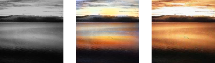
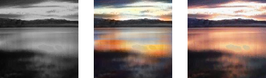
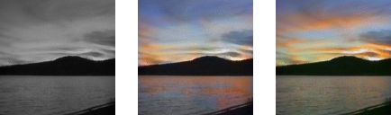
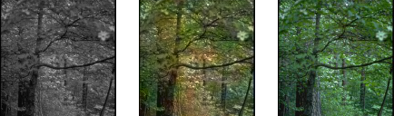
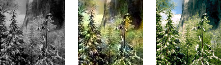
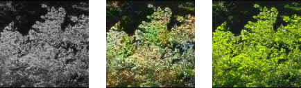

# Colorization

Colorization of grayscale images with Machine Learning Auto Encoder
The train has been done for two separate datasets.
Firstly, the images are transformed from RGB to LAB, then AB are removed for training.
The model trains on ~600 images of 128x128 for each dataset and is tested on ~50 images

The output photos are split in three parts

- Grayscale image
- Predicted image
- Original image

# Coast dataset

# Forest dataset

